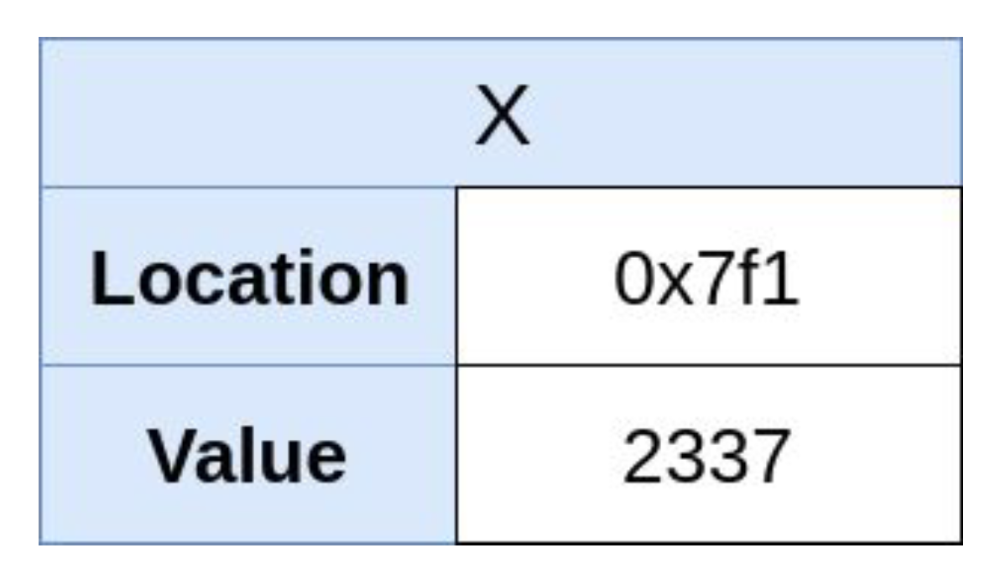
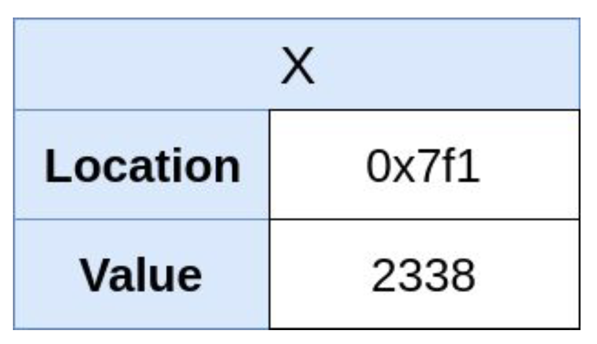
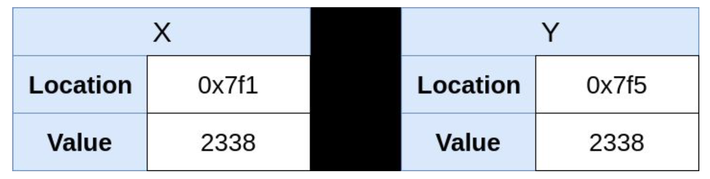
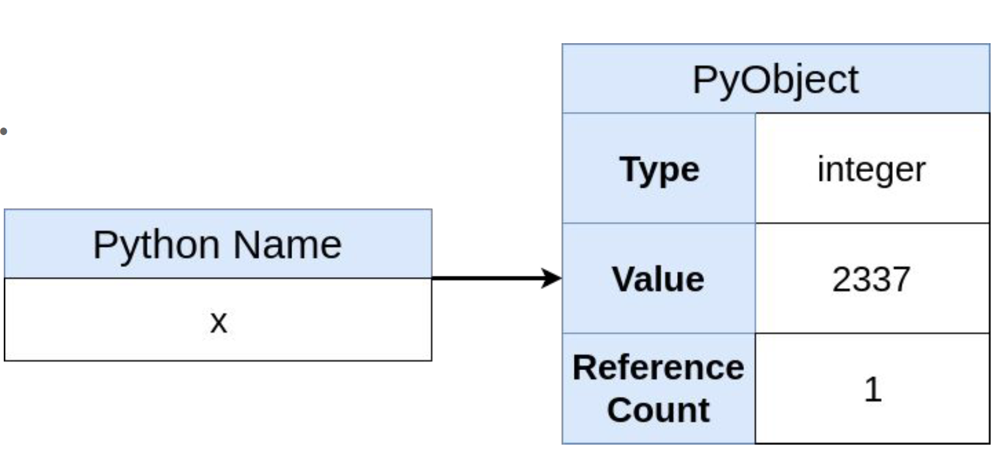
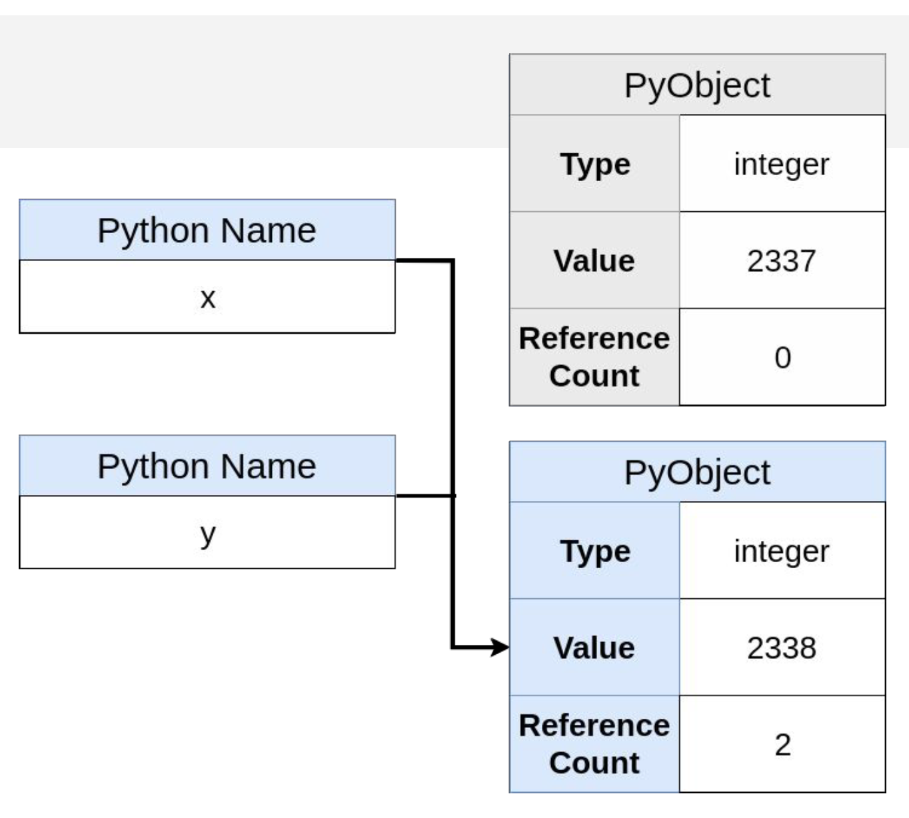
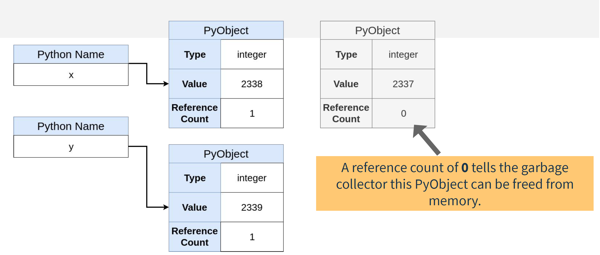

## variables in C

```
int x = 2337;
```

- 分配一块内存空间
- 把 1234 存入到这块内存空间
- x 指向这块内存空间的地址



```
x += 1
```



```
y = x;
```

复制 x 的值到一块新的内存空间



## variables in Python

```
x = 2337
```

- 在内存中创建一个 PyObject
- PyObject 的类型是 integer
- PyObject 的值是 1234
- 创建一个叫 x 的 Python name
- x 指向了这个 PyObject
- PyObject 的引用次数为 1

PyOjbect 并不是我们所熟悉的 Python Object， 它是一个 CPython 的实现，本质是一个 C 的 struct（结构体）



在 Python 中，如果改变 x 的值

```
x += 1
```


创建一个 y，值等于 x

```
y = x
```



```
y += 1
```



## 总结

- 在 Python 中，创建的变量名字是指向了一个在内存中的 PyObject
- 修改一个 immutable 的 Python 变量，实际是重新创建了一个新的 PyObject，然后指向它
- 修改一个 mutable 的 Python 变量，是在原先的 PyObject 上直接修改它的值

## pass-by-value 和 pass-by-reference

Pass-by-Value: （Immutable 类型）

- 把原始变量复制一份，传给函数
- 内存中，PyObject 复制了一份，传递给函数的变量，指向了该 PyObject

```
def change(x):
    x += 10

y = 20
change(y)
print(y)
```

打印的结果应该是 20

Pass-by-Reference （mutable 类型）

- 传递的是内存的地址，这个地址是指向 PyObject 的
- 传递效率高
- 接收函数可以修改原始的 PyObject 值

```
def change(x):
    x.append(3)

y = [1, 2]
change(y)
print(y)
```

打印的结果是 [1,2,3]
